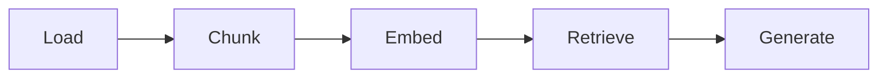
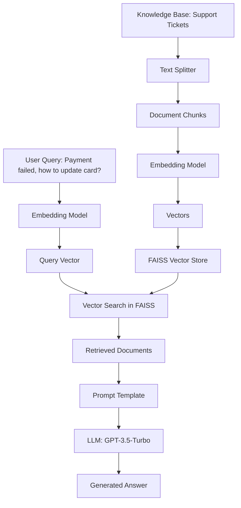

<h1>
  <span class="headline">Building RAG Databases</span>
  <span class="subhead">Setting Up Your RAG Environment</span>
</h1>

**Learning objective:** By the end of this lesson, students will be able to set up a zero-install RAG environment, understand the five core RAG steps, and implement data loading and chunking for a complete retrieval-augmented generation pipeline.

---

## Lab Objective & The "No-Install" Approach

In the last module, we saw how a vector database can give an agent a memory. Now, you're going to build one.

Over the next 80 minutes, you will construct a complete Retrieval-Augmented Generation (RAG) pipeline from start to finish. However, to keep our focus entirely on the RAG workflow, we will bypass complex local setups. Instead of installing databases or managing Docker containers, we will use a streamlined, browser-based environment.

### Our "No-Install" Toolkit

**Google Colab:** A free, browser-based Python environment. No installation needed.

**FAISS (Facebook AI Similarity Search):** A library that creates a temporary, "in-memory" vector store. It exists only while our script is running and requires no setup.

**LangChain & OpenAI:** To orchestrate the pipeline and provide the embedding and reasoning models.

This approach lets us focus on the five core steps of the RAG process:



**Load:** Import your documents and data sources  
**Chunk:** Break documents into meaningful, searchable pieces  
**Embed:** Convert text chunks into numerical vectors  
**Retrieve:** Find relevant chunks based on user queries  
**Generate:** Use an LLM to create answers from retrieved context

---

## Setup in Google Colab

Let's get our environment ready. It only takes a few clicks.

### Step 1: Open Google Colab

Navigate to [https://colab.research.google.com](https://colab.research.google.com) and click "New notebook".

### Step 2: Add Your OpenAI API Key

We need to give our notebook a secure way to access the OpenAI API.

1. In your Colab notebook, click the key icon (🔑) in the left-hand sidebar to open the "Secrets" tab
2. Click "Add a new secret"
3. For the **Name**, enter `OPENAI_API_KEY`
4. For the **Value**, paste your actual OpenAI API key (it starts with `sk-...`)
5. Ensure the "Notebook access" toggle is switched on

Your notebook is now ready.

---

## The Five Core RAG Steps: Foundation Setup

Let's start building our RAG pipeline step by step. We'll begin with the foundation: installing libraries and setting up our environment.

### Step 0: Install Necessary Libraries

Copy this code into your first Colab cell:

```python
# =================================================================
#  Step 0: Install necessary libraries
# =================================================================
# This command sets up our environment inside Colab automatically.
!pip install langchain==0.3.25 openai==1.86.0 langchain-community==0.3.25 faiss-cpu==1.11.0 pandas==2.2.2 tiktoken==0.9.0 langchain-openai==0.3.24 -q
```

**What's happening here?**
- `langchain`: The orchestration framework for our RAG pipeline
- `openai`: Access to OpenAI's embedding and chat models
- `langchain-community`: Additional tools including document loaders
- `faiss-cpu`: In-memory vector database (CPU version for simplicity)
- `pandas` & `tiktoken`: Data manipulation and tokenization support

### Step 1: Setup and Load Data

Now add this code to a new cell:

```python
# =================================================================
#  Step 1: Setup and Load Data
# =================================================================
import os
import pandas as pd
import io
from langchain_community.document_loaders.csv_loader import CSVLoader
from langchain.text_splitter import RecursiveCharacterTextSplitter
from langchain_community.vectorstores import FAISS
from langchain_openai import OpenAIEmbeddings, ChatOpenAI
from langchain.prompts import ChatPromptTemplate
from langchain.schema.runnable import RunnablePassthrough
from langchain.schema.output_parser import StrOutputParser

# Get the API key from Colab's secrets manager
from google.colab import userdata
os.environ["OPENAI_API_KEY"] = userdata.get('OPENAI_API_KEY')

# For this self-contained example, we'll create the CSV data in memory.
# This avoids having to upload any files.
csv_data = """ticket_id,status,description
T001,Open,"My payment failed when trying to renew my subscription. I need to update my credit card information but can't find where to do it in the account settings."
T002,Closed,"I'm having trouble logging into my account. It says my password is incorrect but I'm sure it's right. Can you help me reset it?"
T003,Open,"The billing charge on my credit card doesn't match what I expected. Can someone explain the breakdown of fees?"
T004,Resolved,"I accidentally deleted some important files from my account. Is there a way to recover them from a backup?"
T005,Open,"My subscription was charged twice this month. I need a refund for the duplicate charge."
T006,Closed,"How do I upgrade my plan to include more storage? The current limit is too small for my needs."
T007,Open,"I'm getting error messages when trying to upload large files. The system keeps timing out."
T008,Resolved,"I need to change the email address associated with my account. My old company email is no longer active."
T009,Open,"The mobile app crashes every time I try to sync my data. This is very frustrating."
T010,Closed,"I want to cancel my subscription but can't find the cancellation option anywhere in my account."
T011,Open,"My credit card expired and I need to update the payment method to avoid service interruption."
T012,Resolved,"I'm not receiving email notifications for important account updates. Please check my notification settings."
"""

# Write the data to a temporary file that LangChain can read
with open('support_tickets.csv', 'w') as f:
    f.write(csv_data)

# Load the documents from the CSV file
# Use metadata_columns to include 'ticket_id' and 'status' in the metadata
loader = CSVLoader(file_path='./support_tickets.csv', source_column='description', metadata_columns=['ticket_id', 'status'])
documents = loader.load()
print(f"Loaded {len(documents)} support tickets.")
```

**What's happening here?**
- We import all necessary libraries for our RAG pipeline
- We securely retrieve our OpenAI API key from Colab's secrets
- We create sample support ticket data in CSV format (in a real scenario, this would be your actual documents)
- We use LangChain's `CSVLoader` to parse the data into `Document` objects
- Each document contains the ticket description as content and metadata (ID, status)

### Step 2: Chunk the Documents

Add this code to understand document chunking:

```python
# =================================================================
#  Step 2: Chunk the Documents
# =================================================================
text_splitter = RecursiveCharacterTextSplitter(chunk_size=750, chunk_overlap=50)
chunks = text_splitter.split_documents(documents)
print(f"Split {len(documents)} documents into {len(chunks)} chunks.")

# Let's examine what chunking did to our documents
print("\n--- Before Chunking (First Document) ---")
print(f"Content: {documents[0].page_content}")
print(f"Metadata: {documents[0].metadata}")

print("\n--- After Chunking (First Chunk) ---")
print(f"Content: {chunks[0].page_content}")
print(f"Metadata: {chunks[0].metadata}")
```

**What's happening here?**
- `RecursiveCharacterTextSplitter` breaks documents into smaller, semantically meaningful pieces
- `chunk_size=750`: Maximum characters per chunk (important for embedding model limits)
- `chunk_overlap=50`: Characters that overlap between chunks (preserves context at boundaries)
- Each chunk retains the original document's metadata
- For our support tickets, each ticket is short enough to remain as one chunk

---

## Understanding RAG Architecture

Before we move to embedding and retrieval, let's understand what we're building:



**The Magic of RAG:**
1. **Offline Process:** Documents are chunked, embedded, and stored in the vector database
2. **Runtime Process:** User queries are embedded and matched against stored vectors
3. **Context Injection:** Retrieved documents are "stuffed" into the LLM prompt
4. **Grounded Generation:** The LLM generates answers based only on the provided context

---

## What You've Accomplished

In this first microlesson, you've:

✅ Set up a zero-install RAG development environment  
✅ Understood the five core steps of RAG: Load → Chunk → Embed → Retrieve → Generate  
✅ Implemented data loading from CSV format with metadata preservation  
✅ Applied document chunking with semantic boundary preservation  
✅ Prepared the foundation for vector embedding and retrieval

**Key Insight:** The power of this approach lies in its simplicity. No Docker containers, no complex database setups, no version conflicts. Just pure RAG logic that you can understand and modify.

In the next microlesson, you'll complete the pipeline by embedding your chunks, storing them in a vector database, and building the full retrieval-generation chain that can answer questions about your support tickets with perfect accuracy.

---

**🎯 Ready for the next step?** You're about to see the magic happen when we connect embeddings, retrieval, and generation into a single, powerful chain.
